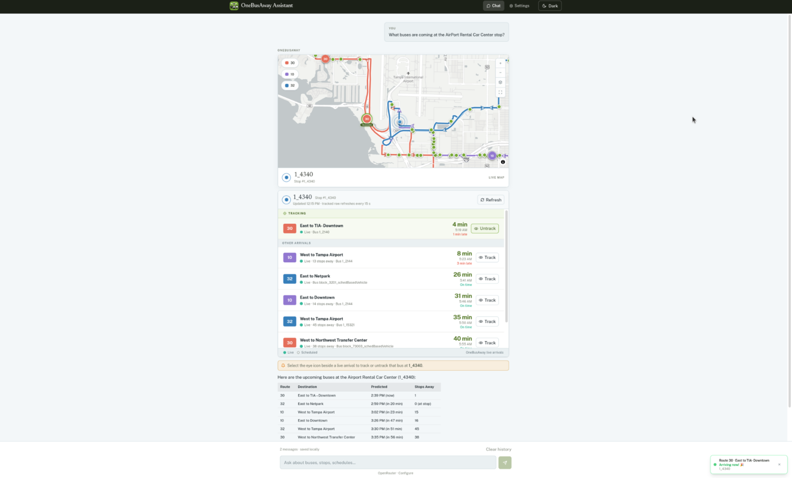
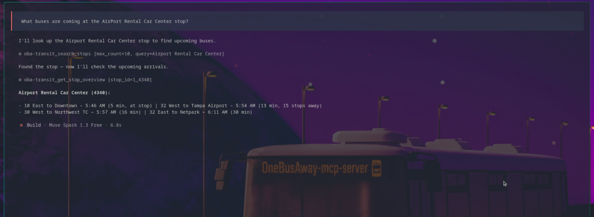

# OneBusAway MCP

Real-time transit data for LLMs, backed by the [OneBusAway](https://onebusaway.org) API.

Ask any MCP-compatible client (Claude, Claude Code, opencode, or your own) questions like *"When is the next bus at 3rd & Pine?"*, *"What routes stop at Memorial Union?"*, or *"Is the P line running on time?"* and get live answers from GTFS and GTFS-realtime feeds.

## Demo

**Web UI** — chat with the assistant, track buses live on a map, and get auto-refreshing arrivals.



**MCP client** — ask transit questions from any MCP-compatible CLI or agent.



## What's in here

Two packages. Use them together or on their own.

| Package | What it is |
| --- | --- |
| [`mcp/`](./mcp/) | The MCP server. A single Go binary. Exposes 29 transit tools over stdio or HTTP. |
| [`ui/`](./ui/) | An optional web chat interface (SvelteKit). Talks to any LLM provider and to the MCP server. |

## How it works

Every question flows through the same chain:

1. **Your LLM** makes a tool call over MCP.
2. **`onebusaway-mcp-server`** turns it into an HTTP request against a OneBusAway backend.
3. **The backend** (e.g. [maglev](https://github.com/OneBusAway/maglev)) returns live transit data sourced from GTFS static and GTFS-realtime feeds.

The web UI is optional. It just adds a browser chat on top of the same MCP server.

## Build your own

This repo pairs an MCP server with a chat UI, but you don't have to use both.

- **Building an agent or app?** Point any MCP client at this server in HTTP mode. The 29 tools become your data layer.
- **Prefer plain REST?** Skip the MCP layer and call a OneBusAway REST server directly. Both [onebusaway-application-modules](https://github.com/OneBusAway/onebusaway-application-modules) (the original Java implementation) and [maglev](https://github.com/OneBusAway/maglev) (its next-generation Go rewrite, same REST API) work as backends.
- **Want a browser starting point?** Fork [`ui/`](./ui/) and adapt it.

The transit data is the same either way. Pick the layer that fits your project.

## Get started

### Register with a CLI AI tool

Build the binary first:

```sh
cd mcp
make build
```

Then hook it into your MCP-compatible tool. Claude Code has a shortcut:

```sh
make mcp-add        # registers with Claude Code at user scope
```

For any other tool (Claude Desktop, opencode, Gemini CLI, or your own), add a stdio MCP entry that points at the built binary:

```json
{
  "command": "/absolute/path/to/mcp/oba-mcp",
  "env": {
    "OBA_BASE_URL": "http://localhost:4000",
    "OBA_API_KEY": "your-key"
  }
}
```

Start a fresh session in your tool and ask a transit question.

### MCP server + web UI, locally

```sh
# Terminal 1: the MCP server
cd mcp
make serve-http     # listens on :8080

# Terminal 2: the web UI
cd ui
npm install
npm run dev         # opens http://localhost:5173
```

### Docker

```sh
docker compose up -d
```

That brings up `oba-mcp` on port 8080 and `maglev` on the internal Compose network. The UI is intentionally kept out of the default compose file; start it with `--profile ui` after putting an authenticated gateway in front.

## Requirements

- **MCP server:** Go 1.26.5 or newer
- **Web UI:** Node.js 20 or newer
- **Backend:** a running [maglev](https://github.com/OneBusAway/maglev) or any OBA-compatible API

## Configuration

At minimum, tell the server where the OBA backend lives and give it a key:

```sh
export OBA_BASE_URL=http://localhost:4000
export OBA_API_KEY=your-key
```

Everything else is documented in [`mcp/README.md`](./mcp/README.md) (server config, tools, caching) and [`ui/CONTRIBUTING.md`](./ui/CONTRIBUTING.md) (UI dev loop, provider setup).

## Deployment

The default is trusted local stdio, which is safe for a personal Claude Code setup or a private MCP client. HTTP mode is for local development and private-network gateway deployments; do not expose it directly to the internet.

Production hardening (TLS, authentication, rate limiting, request IDs) is documented in [`docs/production/phase-0-baseline.md`](./docs/production/phase-0-baseline.md).
